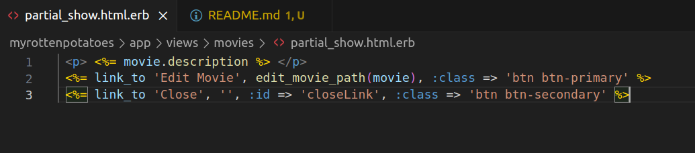
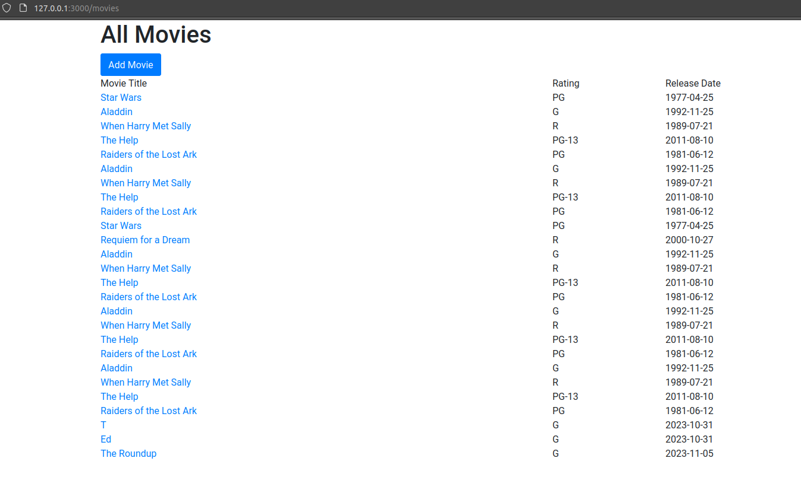
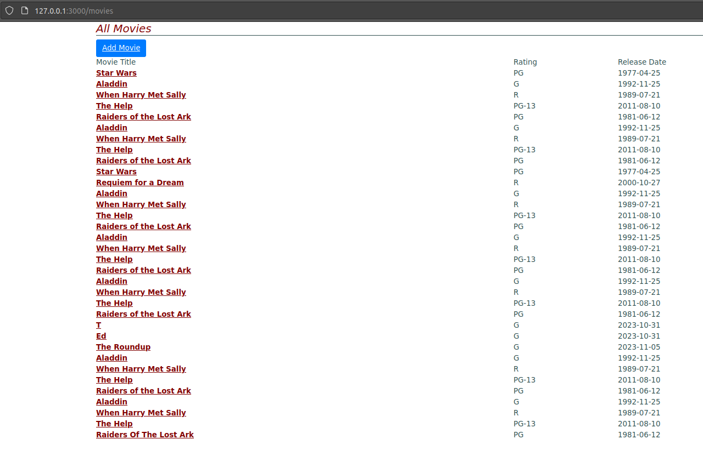

# Ajax

### Parte 1

Creamos una nueva accion de controlador en `myrottenpotatoes/views/movies` llamado `partial_show.html.erb`.



Y modificamos el metodo `show` ubicado en `myrottenpotatoes/app/controllers/movies_controller.rb`.

### Parte 2

Creamos un archivo `show_movie.js` en la ruta `myrottenpotatoes/app/javascript/`.
Explicacion del siguiente codigo:

```js
var MoviePopup = {
  setup: function() {
    // add hidden 'div' to end of page to display popup:
    let popupDiv = $('<div id="movieInfo"></div>');
    popupDiv.hide().appendTo($('body'));
    $(document).on('click', '#movies a', MoviePopup.getMovieInfo);
  }
  ,getMovieInfo: function() {
    $.ajax({type: 'GET',
            url: $(this).attr('href'),
            timeout: 5000,
            success: MoviePopup.showMovieInfo,
            error: function(xhrObj, textStatus, exception) { alert('Error!'); }
            // 'success' and 'error' functions will be passed 3 args
           });
    return(false);
  }
  ,showMovieInfo: function(data, requestStatus, xhrObject) {
    // center a floater 1/2 as wide and 1/4 as tall as screen
    let oneFourth = Math.ceil($(window).width() / 4);
    $('#movieInfo').
      css({'left': oneFourth,  'width': 2*oneFourth, 'top': 250}).
      html(data).
      show();
    // make the Close link in the hidden element work
    $('#closeLink').click(MoviePopup.hideMovieInfo);
    return(false);  // prevent default link action
  }
  ,hideMovieInfo: function() {
    $('#movieInfo').hide();
    return(false);
  }
};
$(MoviePopup.setup);
```

Vemos que el fragmento de código requiere de `jQuery` y `rails-ujs`.
Con ello creamos un objeto `Moviepopup` con los siguientes métodos:
1. `setup()`: Esta función se encarga de configurar el popup. Crea un elemento `div` oculto **(#movieInfo)**, lo oculta y lo agrega al final del cuerpo del documento. También establece un evento de clic en los enlaces de películas dentro del elemento con el **ID #movies**.
2. `getmovieInfo()`: Esta función se activa cuando se hace clic en un enlace de película. Realiza una solicitud AJAX al servidor utilizando la URL del enlace de la película y define funciones de éxito y error.
3. `showMovieInfo()`: Esta función se llama cuando hay una respuesta exitosa de AJAX. Posiciona y muestra el div #movieInfo, luego configura un evento de clic para un enlace de cierre **(#closeLink)** dentro del popup.
4. `hideMovieInfo()`: Esta función oculta el `div` **#movieInfo** cuando se llama, efectivamente cerrando el popup.
Al final vemos `$(MoviepopUp.setup)`, lo que hace es invocar el método setup cuando este listo.

Tambien agregamos

```css
#movieInfo {
  padding: 2ex;
  position: absolute;
  border: 2px double grey;
  background: wheat;
}
```

en la ruta `myrottenpotatoes/app/assets/stylesheets` en el archivo `application.css`.

No olvidarse de las migraciones `rails generate migration CreateMoviegoers`  `rails db:migrate`.
Despues ponemos `rails s` para iniciar el servidor y vamos a localhost.
Hay algunas correcciones, agregar `end` en `movie.rb`.
Despues veremos



Y podremos ver al final: 



## Parte 3
La solucion que brinda `jQuery` es:
```js
$('document').on('click', '.myClass', function() {
  // ...
});
```